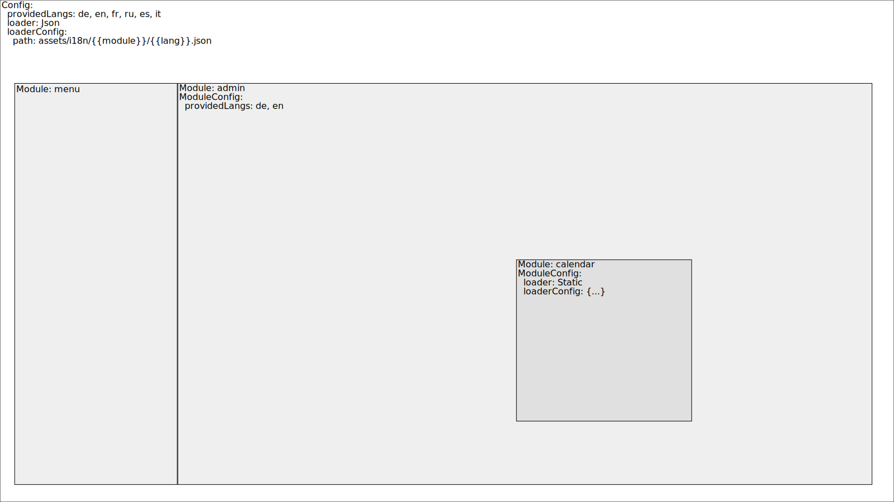

# Translator Modules

With version 2 we support modules. This has some improvements for you:

- You can split your translation files and load them only when needed
- You can use different loader for another module - it could be faster or compiled to the code
- You can provide different modules in different languages

## Example use case



In this use case we defined that we want to use the `TranslationLoaderJson` and provide the languages `de, en, fr, ru,
es, it`. The `loaderConfig` is the default config - we could also omit it.

The menu has own translation files that are provided under `assets/i18n/menu/{{language}}.json`. It also is provided
in all the languages. On the right side is the admin component it uses the translations under 
`assets/i18n/admin/{{language}}.json`. This module is only available in `de` and `en`. Inside this admin component
we use a date picker that uses the translation module `calendar`. Instead of the `TranslationLoaderJson` we use a
custom loader (`TranslationLoaderStatic` here) with a custom configuration. This module is again provided in every language.

This could be the `app.module.ts` for this use case: 

```ts
import { Injectable, NgModule } from '@angular/core';

import { TranslatorModule, TranslationLoader } from 'angular-translator';

@Injectable()
export class TranslationLoaderStatic extends TranslationLoader {
  private static translations: any = {
    calendar: {
      de: {
        'month.0': 'Januar',
        'month.1': 'Februar',
        '...': 'und so weiter'
      },
      en: {
        'month.0': 'January',
        'month.1': 'February',
        '...': 'and so on'
      }
    }
  };

  public load({language, module}: any): Promise<object> {
    const translations = TranslationLoaderStatic.translations;
    if (translations[module] && translations[module][language]) {
      return Promise.resolve(translations[module][language]);
    } else {
      return Promise.reject('This does not exist here... WTF?');
    }
  }
}

@NgModule({
  imports: [
    TranslatorModule.forRoot({
      defaultLanguage: 'de',
      providedLanguages: ['de', 'en', 'fr', 'ru', 'es', 'it'],
      modules: {
        admin: {
          providedLanguages: ['de', 'en']
        },
        calendar: {
          loader: TranslationLoaderStatic
        }
      }
    })
  ],
  providers: [ TranslationLoaderStatic ]
})
export class AppModule {}
```

## The configuration

As you can see in the example we don't have to define every module. All configurations are inherited from the root
configuration. Because the language detection get executed from the `TranslatorContainer` it does not make sense to
change `detectLanguage` inside the modules.

For more information about configuration check the [TranslatorConfig](TranslatorConfig.md) section.

## Use modules

You can use modules explicitly in [TranslateComponent](TranslateComponent.md), [TranslatePipe](TranslatePipe.md) and
in your services or components with [TranslatorContainer](TranslatorContainer.md).
 
In templates:

```html
<p>{{ 'month.0' | translate:{}: 'calendar' }}</p>
<p translate="HOME" translatorModule="menu"></p>
```

In services and components:

```ts
import { Injectable } from '@angular/core';

import { Translator, TranslatorContainer } from 'angular-translator';

@Injectable()
export class MyService {
  private calendarTranslator: Translator;
  
  constructor(private translatorContainer: TranslatorContainer) {
    this.calendarTranslator = translatorContainer.getTranslator('calendar');
  }
}
```

For more details have a look in the appropriate sections of this documentation.

### Overwrite the provider

Thanks to the hierarchical injection system from angular we can overwrite the provider for `Translator` and therefore
use another module for all components under this component (except the components that define another module).

For our example use case we could have this three components:

```ts
import { Component } from '@angular/core';

import { provideTranslator } from 'angular-translator';

@Component({
  selector: 'main-menu',
  providers: [
    provideTranslator('menu')
  ]
})
export class MainMenuComponent {}

@Component({
  selector: 'admin',
  providers: [
    provideTranslator('admin')
  ]
})
export class AdminComponent {}

@Component({
  selector: '[date-picker]',
  providers: [
    provideTranslator('calendar')
  ]
})
export class DatePickerComponent {}
```

Then we can use them in the templates (this is just an example and might not work):

```html
<main-menu>
  <a **ngFor="let item of menu" [translate]="item.title"></a>
</main-menu>

<admin>
  <p>{{ 'BE_CAREFUL' | translate }}</p>
  
  <select name="month" date-picker>
    <option translate="month.0"></option>
    <option translate="month.1"></option>
    <option translate="..."></option>
  </select>
</admin>
```

The `item.title` will get translation from `assets/i18n/menu/{{language}}.json#item.title`, `BE_CAREFUL` comes from 
`assets/i18n/admin/{{language}}.json#BE_CAREFUL` and `month.0` / `month.1` from `TranslationLoaderStatic`.
